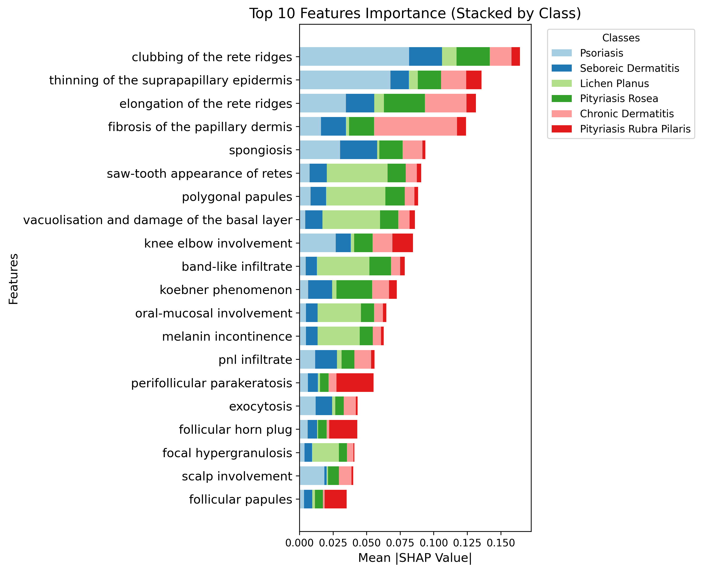

# Purpose & Overview

The purpose of this project is to develop and evaluate machine learning models that can assist dermatologists in classifying patients into specific erythemato-squamous disease categories based on clinical and histopathological data.

For instance, distinguishing between conditions like **psoriasis** and **seborrheic dermatitis** is clinically challenging due to overlapping symptoms. A data-driven solution can enhance diagnostic precision and reduce reliance on invasive procedures like biopsies.

The project focuses on two key objectives:

1. **Developing and comparing several machine learning classifiers** to identify the most accurate model for predicting six types of erythemato-squamous diseases.
2. **Identifying critical clinical and histopathological features** that contribute to these classifications, helping clinicians interpret model outputs.

# Project Goal

Determine what clinical and histopathological features are the most significant predictors that classify patients into specific erythemato-squamous diseases.

# Objectives

1. Analyzing and investigating the dataset to find some insights into our classification model.
2. Training different classification models to come up with the best possible classifications in terms of predefined metrics.
3. Finding the important features based on the detection outcome of our best finding classification model.

# Methodology

1. Exploratory Data Analysis (EDA):
   1.1. Analyze the distribution of clinical and histopathological features.
   1.2. Investigate correlations between features and identify relationships that could aid in classification.
   1.3. Visualize data distributions and correlations to gain insights into the dataset's structure.

2. Data Preprocessing:
   Clean the dataset by:
   2.1. Handling Missing Values:
    The dataset contains 8 missing values in age instances. We addressed this by two different approaches to ensure the integrity of the dataset:
       2.1.1. Removing rows with missing values in 'age' 
       2.1.2. Imputing missing 'age' values with median

   2.2. Feature Transformation:
   We applied a log transformation to skewed features (e.g., 'koebner phenomenon', 'polygonal papules') to reduce skewness and improve model performance by making the data more normally distributed.

   2.3 Standardization:
   Numerical features were standardized using StandardScaler to ensure all features contribute equally to the model by scaling them to have a mean of 0 and standard deviation of 1.

3. Model Development and Evaluation:
   3.1. Develop multiple machine learning models, such as Random Forest, SVM, Decision Trees, and XGBoost, to classify the diseases.
   3.2. Evaluate model performance using metrics like accuracy, precision, recall, F1-score, and confusion matrix.

4. Hyperparameter Tuning:

   Fine-tune the model hyperparameters using techniques like Grid Search and Cross-validation to optimize performance and avoid overfitting.

5. Feature Importance Analysis:

   Analyze the importance of different features in making predictions, providing insights into which clinical and histopathological factors are most significant in diagnosing erythemato-squamous diseases.

6. Model Deployment (Optional):

   Build a user interface and/or API for deploying the trained model, allowing easy access for dermatologists or researchers to use the model for predictions.

## Dermatology Dataset Schema

The Dermatology Dataset consists of **35 attributes** (34 numeric features + 1 class label) used for classifying **six types of skin diseases**.

### Feature Table

| #  | Feature Name                                | Type     | Description |
|----|--------------------------------------------|----------|-------------|
| 1  | Erythema                                  | Integer  | Redness of the skin |
| 2  | Scaling                                   | Integer  | Flaky or peeling skin |
| 3  | Definite borders                          | Integer  | Clear edges of the affected area |
| 4  | Itching                                   | Integer  | Feeling of irritation on the skin |
| 5  | Koebner phenomenon                        | Integer  | New skin lesions appearing after skin injury |
| 6  | Polygonal papules                         | Integer  | Small raised bumps with irregular shapes |
| 7  | Follicular papules                        | Integer  | Small raised bumps around hair follicles |
| 8  | Oral mucosal involvement                  | Integer  | Presence of lesions inside the mouth |
| 9  | Knee and elbow involvement                | Integer  | Affected areas on knees and elbows |
| 10 | Scalp involvement                         | Integer  | Affected areas on the scalp |
| 11 | Family history                            | Binary   | 1 = Skin condition runs in the family, 0 = No family history |
| 12 | Melanin incontinence                      | Integer  | Loss of skin pigment in affected areas |
| 13 | Eosinophils in the infiltrate             | Integer  | Presence of white blood cells in the affected area |
| 14 | PNL infiltrate                            | Integer  | Presence of immune cells that fight infection |
| 15 | Fibrosis of the papillary dermis          | Integer  | Thickening of the upper skin layer |
| 16 | Exocytosis                                | Integer  | Movement of immune cells into the skin |
| 17 | Acanthosis                                | Integer  | Thickening of the outer skin layer |
| 18 | Hyperkeratosis                            | Integer  | Excessive buildup of skin cells |
| 19 | Parakeratosis                             | Integer  | Retention of cell nuclei in the outer skin layer |
| 20 | Clubbing of the rete ridges               | Integer  | Bulbous or rounded skin layer structures |
| 21 | Elongation of the rete ridges             | Integer  | Lengthening of skin structures in the lower epidermis |
| 22 | Thinning of the suprapapillary epidermis  | Integer  | Reduction in thickness of the uppermost skin layer |
| 23 | Spongiform pustules                       | Integer  | Fluid-filled blisters in the skin |
| 24 | Munro microabscess                        | Integer  | Small pus-filled pockets in the skin |
| 25 | Focal hypergranulosis                     | Integer  | Thickening of a specific skin layer |
| 26 | Disappearance of the granular layer       | Integer  | Loss of a protective skin layer |
| 27 | Vacuolisation and damage of basal layer   | Integer  | Damage to the lowest skin layer |
| 28 | Spongiosis                                | Integer  | Swelling between skin cells |
| 29 | Saw-tooth appearance of retes             | Integer  | Jagged pattern in skin structures |
| 30 | Follicular horn plug                      | Integer  | Blocked hair follicles with keratin |
| 31 | Perifollicular parakeratosis              | Integer  | Abnormal skin growth around hair follicles |
| 32 | Inflammatory mononuclear infiltrate       | Integer  | Accumulation of immune cells in the skin |
| 33 | Band-like infiltrate                      | Integer  | Dense layer of immune cells under the skin |
| 34 | Age                                       | Integer  | Age of the patient |
| 35 | Class label                               | Integer  | Disease classification (1-6) |

---

### Class Labels:
- **1:** Psoriasis  
- **2:** Seborrheic dermatitis  
- **3:** Lichen planus  
- **4:** Pityriasis rosea  
- **5:** Chronic dermatitis  
- **6:** Pityriasis rubra pilaris  

🔹 **Dataset Source:** [UCI Machine Learning Repository](https://archive.ics.uci.edu/ml/datasets/Dermatology)  
🔹 **Usage:** Ideal for ML classification tasks related to dermatological diagnosis.

## Key Findings and Results
**1. Explanatory Data Analysis (EDA)**
- **Class Imbalance Analysis:** To ensure that machine learning models do not favor the majority class which may be leading to biased predictions and poor generalization, we show the individual class distributions in our dataset in the the following plot:
  
  
The figure reveals a significant class imbalance, with the first class (shown in red) comprising 30.6% of the total distribution and having approximately at least twice the frequency of any other class. Class 6 (in yellow) represents the smallest segment at only 5.46% of the total, illustrating a highly skewed distribution. However, for the dermatology domain specifically, these imbalances likely reflect the natural rarity of certain skin conditions or clinical signs, making it particularly important to employ techniques that maintain the representation of these minority classes.
- **Feature Distribution Analysis:** The following figure presents the distribution of 34 numerical features, providing visualization of how each clinical sign or symptom is distributed across samples:
  
   

Most features are discrete, with values like 0, 1, 2, or 3, representing the severity or presence of specific dermatological attributes. The visualizations clearly indicate that some features exhibit high skewed distributions rather than normal (Gaussian) distributions. Features like "erythema" (μ: 2.07), "scaling" (μ: 1.80) show strong positive skewness, while many others like "follicular papules" (μ: 0.17) and "family history" (μ: 0.13) appear almost binary in nature. This skewness is crucial to recognize in selecting the proper machine learning algorithms because most parametric machine learning models inherently assume *normally distributed* data. 

-**Feature Correlation Heatmap:** The following figure reveals Spearman correlation heatmap. 

This shows meaningful patterns of association that reflect underlying pathophysiological processes in skin diseases. Such natural groupings provide valuable insights for disease classification by highlighting characteristic of specific conditions, while also identifying features that tend to present independently of others. Additionally, the relatively weak associations between patient age and most clinical features suggest that dermatological conditions in this dataset occurs independently of age, indicating that algorithms may not require age-related adjustments. 
- **Outlier Detection:** Outlier analysis is important as it can indicate data entery errors, measurement errors, and rare conditions. To ensure data quality and address potential outliers, we conducted a comprehensive analysis using multiple methods. First, we applied univariate techniques, including the **Z-score test** and the **IQR test**, to detect outliers in individual features. Since the Z-score and IQR methods sometimes produced different results (as detailed in the table provided in [EDA.ipynb](./Code/EDA.ipynb), we used box plots to visually compare and justify these differences.
Next, we employed the **Isolation Forest** algorithm to perform *multivariate* outlier detection, identifying nine potential outliers. To further investigate, we conducted PCA (Principal Component Analysis) to visualize the data distribution and assess whether these points formed isolated clusters. As shown in the PCA plot, the data points formed well-defined clusters corresponding to different classes. Based on these findings, we concluded that the identified "outliers" were meaningful variations rather than errors or noise, and we retained all data points for further analysis.

- **Understanding of Data using t-SNE:** We used t-SNE to visualize how the data naturally forms clusters. The results showed that some classes, like 1, 3, and 6, are clearly separated into distinct groups, making them easier to classify. However, other classes, such as 2, 4, and 5, overlap significantly, which makes it harder to distinguish them visually or through classification models. 

**2. Data Preprocessing:**
  - **Train-test Split:** We did perform a train-test split before data preprocessing to avoid **data leakage** for standardization, imputation and model training and opimization.
  - **Handling Missing Values:** Our statistical analysis revealed that the age attribute has missing values. In this part we handle the missing values by comparing different imputation methods: median, mean and KNN imputations.

As can be seen, the probability density distributions of the original and imputed *'age'* variable show significant overlap between values. To preserve the original age distribution, we chose the simplest imputation method: using the median. This approach ensures that the age variable distribution remains consistent with the dataset's overall structure and avoids introducing bias.
 
**3. ML model Training:** 

  We selected different classifiers with unique strengths that make it suitable for handling our dataset, which includes imbalanced classes and skewed features. **SVM** is robust for moderately   imbalanced data because it focuses on support vectors near decision boundaries, making it less influenced by outliers or majority-class dominance. **Random Forest** and **Extra Trees** are ensemble methods that handle imbalanced data effectively by combining multiple decision trees. **Naive Bayes**, though simple, works well with skewed data due to its probabilistic approach, which assumes feature independence but can still provide quick and interpretable results. Lastly, **KNN** is sensitive to class imbalance but can be tuned with weighted voting to improve performance in overlapping or minority-class regions.
  -**Pipelines:** We created different preprocessing steps for our models. For SVM, KNN, and Naive Bayes, we standardized the data to make sure all features are on the same scale, which helps these models work better. For XGBoost, Random Forest and Extra Trees, we didn't run standardization because these models can handle features of different scales naturally.

 - **Class Weighting** We assigned higher weights to the minority class, forcing the model to pay more attention to its patterns and reducing bias toward the majority class.
 - **Hyperparameter Tuning**: We decided to choose *Baysin Hyperparameter Optimization (Optuna)* rather than *grid search* because it efficiently navigates the hyperparameter space by building a probabilistic model, leading to better performance with fewer evaluations. The following parameters is chosen for each classifier:
   - **SVM**:
       -  **C:** regularization parameter that managing the model's complexity.
       - **Gamma:** determines how far the influence of a single training example reaches, with low values meaning 'far' and high values meaning 'close'. 
       - **Kernel function:** transforms the input data into a higher-dimensional space, enabling the SVM to handle non-linear classification problems by finding an optimal hyperplane.
   - **XG Boost/Random Forest/ Extra Tree**
       - **learning_rate:** controls the contribution of each new tree to the overall model.
       -  **max_depth:** sets the maximum depth of each decision tree.
       -   **subsample:** denotes the fraction of the training data to be randomly sampled for each boosting round.
       -   **colsample_bytree:** represents the fraction of features to be randomly sampled for each tree.
       -   **min_samples_split:** the minimum number of samples required at an internal node to consider splitting it into further sub-nodes.
    - **KNN**
      - **Distance Metric:** Euclidean, Manhattan.
      - **Number of Neighbors:** Number of nearest neighbor to consider.
      - **Distance Weights:** Neighbors closer to the query point have a greater influence on the prediction than those farther away.
- **Perfromance Metrics:** Accuracy, Precision, Recall, F1
  
**4. Best Model Selection**

  As can be seen in the following figure, the **Extra Trees Classifier** performed the best, achieving an **accuracy, precision, recall, and F1-score of 0.986486**. This suggests that it consistently makes correct predictions across all classes. Looking at class 6 (the rare class), Extra Trees successfully identified **4 instances correctly** with no misclassifications, demonstrating its strength in handling imbalanced data. This suggests that the model benefits from its **ensemble nature and ability to reduce overfitting**, making it the most reliable choice for this dataset.
  

**5. Feature Importance Analysis**

  The following figure illustrates feature importance rankings derived from different classifiers. Across the models, certain features consistently appear as highly important, such as "fibrosis of the papillary dermis," "vacuolisation and damage of the basal layer," and "clubbing of the rete ridges." This consistency suggests these features are critical for distinguishing dermatological conditions regardless of the classifier used. Additionally, permutation-based methods (SVM, Naive Bayes, KNN) focus on different features compared to built-in importance measures (XGBoost, Random Forest). This highlights the need for careful selection of feature importance techniques depending on the model.

**6. SHAP Analysis of Feature Importance**

The SHAP (SHapley Additive exPlanations) figure provides a detailed breakdown of feature importance across six dermatological conditions. For instance, the SHAP analysis for **psoriasis** identifies **"Clubbing of the rete ridges"** as the most influential feature, with a high positive SHAP value indicating its strong contribution to psoriasis classification. "Thinning of the suprapapillary epidermis" and "spongiosis" also emerge as significant contributors, reflecting important histopathological characteristics of psoriasis. Other features like "elongation of the rete ridges" and "fibrosis of the papillary dermis" play a secondary role but still provide meaningful contributions. The importance of these features aligns with clinical findings, where epidermal changes and dermal inflammation are central to psoriasis pathology. In addition, the SHAP visualizations reveal several cross-condition patterns in feature importance. For example, while **"fibrosis of the papillary dermis"** is critical for **chronic dermatitis** classification, it plays a less significant role in other conditions like **psoriasis**. Similarly, features like "clubbing of the rete ridges" show variable importance across conditions—being highly influential for psoriasis but less so for **pityriasis rubra pilaris**.

**7. SHAP Bar Plot Analysis**

The SHAP bar plot provides a comprehensive overview of feature importance across all classes. By aggregating the mean absolute SHAP values for each feature, the visualization highlights the average impact of individual histopathological features on model predictions across six dermatological conditions. For instance, the most impactful features across all classes include "clubbing of the rete ridges", "elongation of the rete ridges",  "thinning of the suprapapillary epidermis", and "spongiosis" These features consistently exhibit high mean SHAP values, indicating their significant contributions to distinguishing between dermatological conditions.

- **Clubbing of the rete ridges** emerges as the most influential feature overall, with substantial contributions across multiple conditions. Its prominence reflects its diagnostic relevance in disorders like psoriasis and seborrheic dermatitis, where epidermal structural changes are critical.
- **Thinning of the suprapapillary epidermis** is highly specific to psoriasis but also contributes moderately to other conditions.
- **Elongation of the rete ridges** is another key feature with widespread impact across classes. This structural alteration is particularly relevant in psoriasis and pityriasis rosea.
- **Fibrosis of the papillary dermis** characterized by the excessive accumulation of collagen in the upper dermal layer, ranks second in importance. This fibrosis plays a vital role in various dermatological conditions, leading to skin thickening and altered texture.

  Features such as "vacuolisation and damage of the basal layer," "band-like infiltrate," "saw-tooth appearance of rete ridges exhibit moderate SHAP values. These features are more condition-specific but still contribute significantly to model predictions.

  - **Vacuolisation and damage of the basal layer** is particularly critical for lichen planus, reflecting its pathophysiological hallmark.
  - **Band-like infiltrate** aligns with lichen planus' characteristic lymphocytic infiltration at the dermoepidermal junction.
  - **Saw-tooth appearance of rete ridges** is another distinctive feature for lichen planus, while **Koebner phenomenon** contributes to psoriasis and pityriasis rosea.

## Clinical Implications

This SHAP analysis enhances interpretability by quantifying feature importance across all classes simultaneously. By identifying globally dominant features (e.g., clubbing of rete ridges) alongside condition-specific markers (e.g., vacuolisation for lichen planus), clinicians can better understand how machine learning models arrive at their predictions.

## Conclusion
The study provides a comprehensive analysis of dermatological data, addressing key challenges such as class imbalance, feature skewness, and outlier detection. Through careful data preprocessing, including handling missing values and scaling features appropriately, we ensured that the models were trained on high-quality data. Various machine learning models were evaluated, with the Extra Trees classifier emerging as the best-performing model due to its robustness against imbalanced data and strong generalization ability. Feature importance and SHAP analysis further highlighted key clinical attributes that contribute to disease classification, offering valuable insights for dermatologists. Overall, this project demonstrates the potential of machine learning in dermatology, helping improve diagnostic accuracy and supporting clinical decision-making.

## Team Members

| Name              | GitHub Account                            | Email                                                    | Roles/Responsibilities                                       | Reflection Video |
|------------------ |--------------------------------------------------|-----------------------------------------------------------|--------------------------------------------------------------------|------------------|
| Mandana Goudarzian          | [@mandana-g](https://github.com/mandana-g)         | [goudarzian@hotmail.com](mailto:goudarzian@hotmail.com)                     | Data cleanup, model development and optimization                   | [Reflection Video](https://drive.google.com/file/d/1XwqGuebDLpGIRz7meL-5CXr0lY6cKSCF/view?usp=sharing) |
| Teressa           | [@teresa-le](https://github.com/teresa-le)         | [teresale8@gmail.com](mailto:teresale8@gmail.com)                     | Data cleanup, model development and optimization                   | [Reflection Video](https://www.loom.com/share/408deef3649042439b2c0e5f56669f63?sid=8032444b-13ac-454d-9169-41c8e283d38b) |
| Carlos            | [@carvas91](https://github.com/carvas91)         | [carvas91@hotmail.com](mailto:carvas91@hotmail.com)                     | Data cleanup, model development and optimization                   | [Reflection Video](https://drive.google.com/file/d/1u0XRdedF523vV5f-rs_MiUmUSCfBb0VM/view?usp=drive_link) |
| Hossein Khonsari  | [@hossein2024-hub](https://github.com/hossein2024-hub)   | [hossein@gmail.com](mailto:hossein.khonsari@gmail.com)    | Data cleanup, model development and optimization                   | [Reflection Video](https://www.veed.io/view/d637c9d3-6701-433c-85b2-37337ca4d8cc?panel=share) |            |

    

# Tasks Breakdown

| No. | Task |
|---- | -----|
| 1   |EDA(Exploratory Data Analysis)|
| 2   | Data preprocessing( standardization, imputation, encoding(?)) |
| 3   | Model Development( suggested models: Random Forest, XGBoost, Neural Network, SVM, KNN, Decision Tree) |
| 4   | Initial Model Evaluation |
| 5   | Hyper Parameter Tuning (Grid Search, Cross-validation, etc)|
| 6   | Final Model Evaluation | 
| 7   | Feature Importance Analysis | 
| 8   | Presentation/Explanation    | 
| 9   | (Optional) User Interface, APIs | 
| 10  | (Future Works): 1. Designing semi-supervised learning by use of Generative Adversarial Network. 2. Optimization  | 

# Dataset Information

This database contains 34 attributes, 33 of which are linear valued and one of them is nominal. 

The differential diagnosis of erythemato-squamous diseases is a real problem in dermatology. They all share the clinical features of erythema and scaling, with very little differences. The diseases in this group are psoriasis, seboreic dermatitis, lichen planus, pityriasis rosea, cronic dermatitis, and pityriasis rubra pilaris. Usually a biopsy is necessary for the diagnosis but unfortunately these diseases share many histopathological features as well. Another difficulty for the differential diagnosis is that a disease may show the features of another disease at the beginning stage and may have the characteristic features at the following stages. Patients were first evaluated clinically with 12 features. Afterwards, skin samples were taken for the evaluation of 22 histopathological features. The values of the histopathological features are determined by an analysis of the samples under a microscope. 

In the dataset constructed for this domain, the family history feature has the value 1 if any of these diseases has been observed in the family, and 0 otherwise. The age feature simply represents the age of the patient. Every other feature (clinical and histopathological) was given a degree in the range of 0 to 3. Here, 0 indicates that the feature was not present, 3 indicates the largest amount possible, and 1, 2 indicate the relative intermediate values.

The names and id numbers of the patients were recently removed from the database.

Reference: https://archive.ics.uci.edu/dataset/33/dermatology

# Tools & Technologies 
We used Python to explore, clean, analyze and visualize our data. 

## Libraries 
The following libraries were used: 
* ucimlrepo
* optuna
* shap
* lime
* pandas
* numpy 
* matplotlib
* seaborn 
* sklearn
* xgboost 
* joblib
* warnings
* random
* os

## Installation Instructions 
To run the models and find the most important features, run the notebooks in the 'Code' folder 

To run the notebooks, you will need one of the following: 
* IDE
* Google Colab 

### IDE 
1.  Download an IDE onto your computer e.g. Python, VSCode
2.  Launch the IDE 
3. Ensure that you have the appropriate libaries installed 
4. Locate and run the notebooks

### Google Colab 
1. Go to colab.research.google.com
2. Sign in with your Google account
3. Upload the notebook 
4. Click 'Run All' under 'Runtime' to run the notebooks 

## Models
To develop models that can be used to classify the data and predict the dermatological conditions, we used the following methods:
* NaiveBayes 
* KNN
* SVM
* Decision Tree
* XGBoost
* Random Forest 
* Extra Trees
